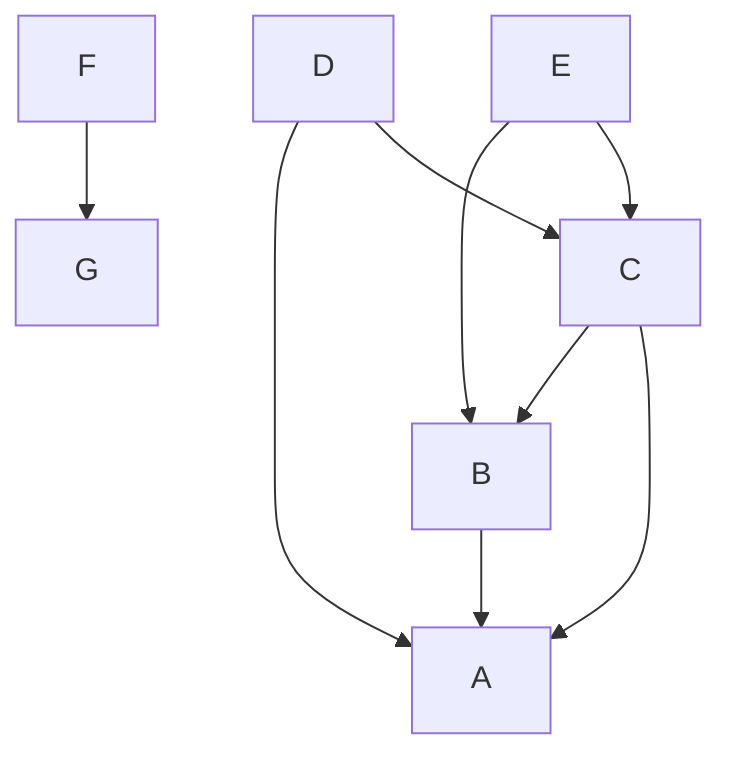

# Python-workflow

```commandline
rm build/ python_dependency_resolver.egg-info dist -Rf
python3 setup.py bdist_wheel
pip3 install -I dist/python_dependency_resolver-*-py3-none-any.whl
```


```python
from python_dependency_resolver import DependencyResolver
tree = {
    'A': (),
    'B': ('A'),
    'C': ('B', 'A'),
    'D': ('C', 'A'),
    'E': ('C', 'B'),
    'F': ('G'),
    'G': ()
}

dependency_resolver = DependencyResolver()
dependency_resolver.resolve(tree)
# ['A', 'B', 'C', 'D', 'E', 'G', 'F']
```

**Documentation**
- <https://www.electricmonk.nl/log/2008/08/07/dependency-resolving-algorithm/>
- <http://mamchenkov.net/wordpress/2016/11/22/dependency-resolution-with-graphs-in-php/>

## Contributors
**Anthony K GROSS**
- <http://anthonykgross.fr>
- <https://twitter.com/anthonykgross>
- <https://github.com/anthonykgross>

**Joshua Behrens**
- <https://github.com/JoshuaBehrens>

## Copyright and license
Code and documentation copyright 2024. Code released under [the MIT license](https://github.com/anthonykgross/python-dependency-resolver/blob/master/LICENSE).