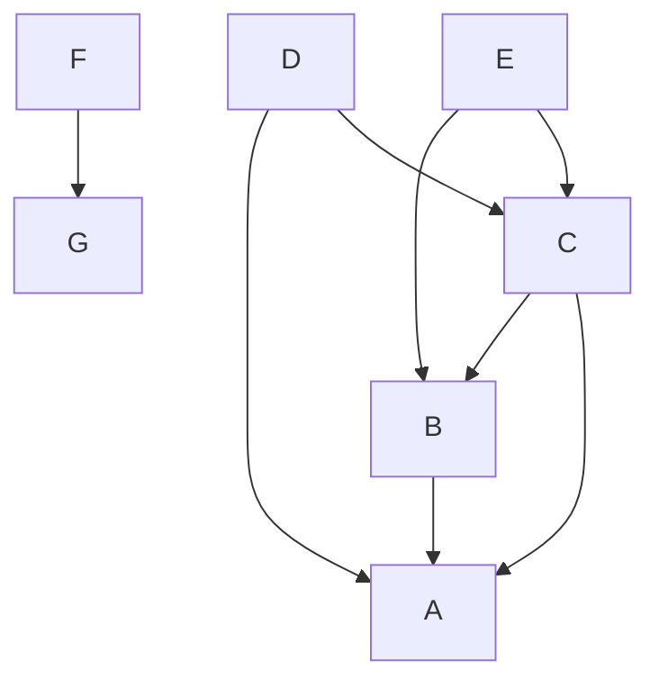

# Python-workflow

```commandline
rm build/ python_dependency_resolver.egg-info dist -Rf
python3 setup.py bdist_wheel
pip3 install -I dist/python_dependency_resolver-*-py3-none-any.whl
```


```python
from python_dependency_resolver import DependencyResolver
tree = {
    'A': (),
    'B': ('A'),
    'C': ('B', 'A'),
    'D': ('C', 'A'),
    'E': ('C', 'B'),
    'F': ('G'),
    'G': ()
}

dependency_resolver = DependencyResolver()
dependency_resolver.resolve(tree)
# ['A', 'B', 'C', 'D', 'E', 'G', 'F']
```